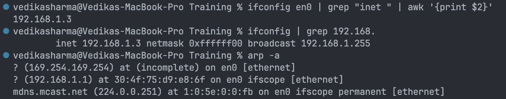
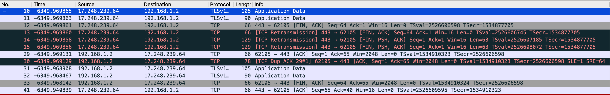

# Networking Fundamentals

## **Objective**
**Build a strong networking foundation from zero**

---

## **Topics**

### **What is Networking?**

Networking is the process of connecting two or more devices so they can communicate and share data.

---

### **LAN / WAN / VPN / Internet Concepts**

---

### **LAN (Local Area Network)**

A **LAN** is a network that connects devices within a **small, localized area** such as a home, office, or school.

It allows devices to share:
- Files
- Printers
- Internet access

Common technologies used in a LAN:
- **Ethernet**
- **Wi-Fi**

---

### **WAN (Wide Area Network)**

A **WAN** connects **multiple LANs** over **large geographical distances**, such as between cities or countries.

It enables communication between remote locations using:
- **Leased lines**
- **Satellite links**
- **Public Internet**

---

### **VPN (Virtual Private Network)**

A **VPN** creates a **secure, encrypted tunnel** over a public network (such as the internet).

It provides:
- **Privacy**
- **Security**
- **Access to restricted/private resources**

Users experience connectivity **as if they are directly connected to a private network**.

---

### **Internet**

The **Internet** is the **global network of interconnected computers and networks** that operate using the **TCP/IP protocol suite**.

It enables:
- Worldwide communication
- Information sharing
- Access to services such as:
  - Websites
  - Email
  - Cloud applications

---

### **LAN vs MAN vs WAN Comparison**

| Feature        | LAN                         | MAN                          | WAN / Internet               |
|----------------|-----------------------------|------------------------------|------------------------------|
| Area Covered   | Local (Room / Building)     | City / Metropolis            | Global (Country / World)     |
| Transmission   | Ethernet, Wi-Fi             | Fiber Optics, Microwave      | Satellite, Leased Lines      |

---

### **OSI Model**
**All layers explained with simple examples**

The Open Systems Interconnection model (**OSI model**) is a seven layer conceptual model that characterizes and standardizes the communication functions of a telecommunication or computing system.

The **physical layer**, which is the bottom layer of the OSI model, is concerned with the transmission and reception of the unstructured raw bit stream over a physical medium. It describes the electrical/optical, mechanical, and functional interfaces to the physical medium, and it carries the signals for all of the higher layers.

The **data link layer** provides error-free transfer of data frames from one node to another over the physical layer, allowing layers above it to assume virtually error-free transmission over the link.

The **network** layer controls the operation of the subnet, deciding which physical path the data should take based on network conditions, priority of service, and other factors.

The **transport layer** ensures that messages are delivered error-free, in sequence, and with no losses or duplications.

The **session layer** allows session establishment between processes running on different stations.

The **presentation layer** formats the data to be presented to the application layer. It can be viewed as the translator for the network. This layer may translate data from a format used by the application layer into a common format at the sending station, then translate the common format to a format known by the application layer at the receiving station.

The **application layer** serves as the window for users and application processes to access network services.

**Application Layer Protocols**
| Protocol | Purpose |
|--------|--------|
| HTTP / HTTPS | Web browsing |
| FTP | File transfer |
| SMTP | Send emails |
| POP3 / IMAP | Receive emails |
| DNS | Name to IP resolution |
| SSH | Secure remote access |
| Telnet | Remote access (insecure) |
| SNMP | Network monitoring |

**OSI** is like ordering food online:

	•	App → Application
	•	Formatting order → Presentation
	•	Tracking order → Session
	•	Delivery assurance → Transport
	•	Route planning → Network
	•	Delivery person identity → Data Link
	•	Road → Physical

| Layer | Name         | Simple Responsibility                  | PDU (Protocol Data Unit) |
|------:|--------------|----------------------------------------|--------------------------|
| 7     | Application  | User interaction                       | Data                     |
| 6     | Presentation | Format, encryption                     | Data                     |
| 5     | Session      | Session management                     | Data                     |
| 4     | Transport    | Reliable data delivery (TCP/UDP)       | Segment (TCP) / Datagram (UDP) |
| 3     | Network      | IP addressing & routing                | Packet                   |
| 2     | Data Link    | MAC addressing & framing               | Frame                    |
| 1     | Physical     | Transmission of bits                   | Bits                     |

Data → Segment → Packet → Frame → Bits

**PDU** is the name given to data at each OSI layer as it moves through the network stack.

### **TCP/IP Model**

**Architecture and differences from OSI**

- **DoD 4 Model** stands for **Department of Defense networking model**
- Also known as the **TCP/IP Model**
- Consists of **4 layers**
- **Simpler** than the OSI model
- Used by the **Internet in real-world networking**

---

### **Protocol Headers**
1. TCP Header  
2. UDP Header  
3. IP Header  
4. Ethernet Header 
---
**TCP Header**

 **Source Port(16 bits)**: The source port number(sending application).
 **Destination Port(16 bits)**:The destination port number(receiving application).

	•	Allows 65,536 ports (0–65535)
	•	Well-known ports: 0–1023
	•	Registered ports: 1024–49151
	•	Ephemeral ports: 49152–65535
    
	Client:  192.168.1.10:52344
    Server:  172.217.0.46:443 (HTTPS)

**Sequence Number(32 bits)**: Each byte of data gets a unique number, like tracking numbers on packages. Real-time example: You're downloading a 10MB video file. The sender breaks it into chunks and labels them: bytes 1-1000 (sequence 1), bytes 1001-2000 (sequence 1001), etc. If packet 5001 arrives before 3001, your computer knows to wait and reorder them correctly.

**Acknowledgment Number (32 bits)**: The acknowledgment number indicates the next byte the receiver expects to receive and confirms successful receipt of all bytes before this number.

**Data Offset(DO)**:Specifies the length of the TCP header in 32-bit words. A 4-bit field that tells the receiver where the header ends and the actual data begins.

### **TCP Flags**

### **Modern TCP headers have 9 control flags, not just 6.**

Control Flags: 9 flags (URG, ACK, PSH, RST, SYN, FIN, NS, CWR, ECE)

	•	SYN – Starts a TCP connection (used in the 3-way handshake)
	•	ACK – Confirms successful receipt of data or control packets (set on almost all packets after connection setup)
	•	FIN – Gracefully closes a connection when no more data is to be sent
	•	Reset – Abruptly terminates a connection due to errors or unexpected conditions

	•	Push – Requests immediate delivery of received data to the application
	•	Urgent – Indicates the presence of urgent data (used with the Urgent Pointer)

### Example of Push and Urgent flag:

Difference between "sending data immediately" (PSH) and "interrupting the data stream" (URG).

**Push flag**:
SSH/Telnet Sessions

When you type commands in an SSH terminal session, each keystroke is sent immediately with the PSH flag set. This prevents buffering and ensures your typing appears instantly on the remote server, making the terminal feel responsive. Without PSH, your keystrokes would wait in a buffer until enough data accumulated, causing noticeable lag in interactive sessions.

**Urgent flag**:
The most common real-world use of the URG flag is when you press Ctrl+C to interrupt a running process in an SSH or Telnet session. The interrupt signal is marked as urgent and processed immediately, even if there's data already queued in the buffer. This allows you to kill a stuck command without waiting for normal data processing.

### **FIN vs RST (TCP Connection Termination)**

| TCP Flag | Shutdown Type | Data Handling | Packets Used | When It Happens |
|----------|---------------|---------------|--------------|-----------------|
| **FIN**  | Graceful shutdown | Data delivered fully | Uses 4 packets | Normal behavior |
| **RST**  | Abrupt termination | Data may be lost | Usually 1 packet | Error condition |

### **Congestion Control (ECN-related)**

	•	ECE (ECN-Echo)– Signals network congestion detected via ECN
	•	CWR(Congestion Window Reduced) – Confirms that the sender has reduced its sending rate due to congestion
	•	NS (Nonce Sum) – Experimental flag used with ECN to detect misbehaving receivers (rarely used)

**Window Size**

Specifies how much data the receiver is willing to accept.  
Implements flow control to prevent buffer overflow.

**Checksum**

Used to verify the integrity of the TCP header and data.  
Protects against corruption during transmission.

**Urgent Pointer**

Indicates the end of urgent data in the TCP stream when the URG flag is set.  
Rarely used in modern applications.

**Options**
Carries additional TCP capabilities such as MSS, window scaling, and timestamps.  
Allows TCP to optimize performance.

**Padding**

Adds extra bits to ensure the TCP header length is a multiple of 4 bytes.  
Contains only zero values.

**Data**
Handed down to the TCP protocol at the Transport layer, which includes the
upper-layer headers. Contains the actual application payload being transmitted.  

---

### **UDP Header**

## UDP Header Fields

- **Source Port**: Port number of the application on the sending host.
- **Destination Port**: Port number of the requested application on the destination host.
- **Length**: Total length of the UDP header + UDP data.
- **Checksum**: Error-checking value calculated over the UDP header and data  
  (UDP performs its own CRC, independent of lower layers).
- **Data**: Upper-layer application data (for example, DNS, Video streaming, VoIP).

### Note

Even though the **Frame Check Sequence (FCS)** at the Data Link layer provides CRC,  
**UDP does not trust lower layers**, so it still computes its own checksum.

---

### **IP Header**

---

### **Ethernet Header**

### **MAC, IP, ARP Basics**

**MAC Address**: Hardware identifier (Layer 2 - Data Link)

**IP Address**: Logical network identifier (Layer 3 - Network)

**ARP**: Protocol that maps IP to MAC addresses

**MAC Address (Media Access Control)**

What is a MAC Address?
A MAC address is a unique 48-bit (6-byte) hardware identifier permanently assigned to a network interface card (NIC) by the manufacturer.

XX:XX:XX:XX:XX:XX  or  XX-XX-XX-XX-XX-XX

Example: 00:1A:2B:3C:4D:5E
         └─┬─┘ └────┬────┘
           │        │
    OUI (Vendor)  Device ID

| Component                                | Bits              | Description             | Example          |
| ---------------------------------------- | ----------------- | ----------------------- | ---------------- |
| OUI (Organizationally Unique Identifier) | 24 bits (3 bytes) | Manufacturer identifier | 00:1A:2B (Cisco) |
| Device ID                                | 24 bits (3 bytes) | Unique device number    | 3C:4D:5E         |

**IP Address (Internet Protocol)**

What is an IP Address?
An IP address is a logical 32-bit (IPv4) or 128-bit (IPv6) address assigned to devices to identify them on a network.

IPv4 Address
Format: Four octets separated by dots (dotted-decimal notation)

192.168.1.100
└─┬─┘└─┬─┘└┬┘└─┬─┘
  │    │   │   │
Network Part  Host Part

Binary Representation:

192.168.1.100

11000000.10101000.00000001.01100100
└────────────┬──────────┘└────┬───┘
        Network          Host

**IPv4 Address Classes**
| Class | Range                       | Default Subnet Mask | Use Case             |
| ----- | --------------------------- | ------------------- | -------------------- |
| A     | 1.0.0.0 - 126.255.255.255   | 255.0.0.0 (/8)      | Large organizations  |
| B     | 128.0.0.0 - 191.255.255.255 | 255.255.0.0 (/16)   | Medium organizations |
| C     | 192.0.0.0 - 223.255.255.255 | 255.255.255.0 (/24) | Small networks       |
| D     | 224.0.0.0 - 239.255.255.255 | N/A                 | Multicast            |
| E     | 240.0.0.0 - 255.255.255.255 | N/A                 | Experimental         |

Special IP Addresses

| Address         | Purpose                      |
| --------------- | ---------------------------- |
| 0.0.0.0         | This network                 |
| 127.0.0.1       | Loopback (localhost)         |
| 169.254.x.x     | APIPA (Automatic Private IP) |
| 10.0.0.0/8      | Private network (Class A)    |
| 172.16.0.0/12   | Private network (Class B)    |
| 192.168.0.0/16  | Private network (Class C)    |
| 255.255.255.255 | Broadcast (all hosts)        |

When used in routing tables, 0.0.0.0/0 means "any destination" or "all networks" - the default route.

**ARP**
What is ARP?
ARP is a protocol that maps IP addresses (Layer 3) to MAC addresses (Layer 2) on a local network. It answers the question: "What is the MAC address for this IP address?"

PC1 (192.168.1.3) wants to send data to PC2 (192.168.1.1)

1. PC1 checks ARP cache → not found
2. PC1 broadcasts: "Who has 192.168.1.1?"
3. All devices receive request
4. PC2 replies: "I'm 192.168.1.1, my MAC is 00:AA:BB:CC:DD:EE"
5. PC1 caches mapping and sends data to 00:AA:BB:CC:DD:EE

**Note**: “The first ping often drops because the system must perform ARP resolution to map an IP address to a MAC address before it can send the ICMP packet.”
---
### **TCP vs UDP**

| Aspect               | TCP                         | UDP                          |
|----------------------|-----------------------------|------------------------------|
| Connection Type      | Connection-oriented         | Connectionless               |
| Reliability          | Guaranteed                  | Not guaranteed               |
| Data Ordering        | Preserved                   | Not preserved                |
| Speed                | Slower                      | Faster                       |
| Overhead             | High                        | Low                          |
| Error Handling       | Retransmission              | None                         |
| Flow Control         | Yes (Sliding window)        | No                           |
| Congestion Control   | Yes                         | No                           |
| Acknowledgments      | Required                    | Not used                     |
| Packet Loss Handling | Retransmits packets         | Packets dropped              |
| Header Size          | Larger (20+ bytes)          | Smaller (8 bytes)            |
| Connection Setup     | 3-way handshake             | No setup                     |
| Latency              | Higher                      | Lower                        |
| Delivery Type        | Reliable byte stream        | Best-effort datagrams        |
| Virtual Circuit      | Yes                         | No                           |
| Buffer Management    | Uses receiver buffers       | Minimal buffering            |
| Windowing            | Yes                         | No                           |
| Session Support      | Yes                         | No                           |
| Typical Use Cases    | Web, SSH, FTP               | VoIP, Video Streaming        |

Video streaming server sends 1000 packets/second
Receiver can only process 500 packets/second
Result: 500 packets dropped every second
UDP doesn't care - just keeps sending

# Common Protocols and Port Numbers

| Application        | Protocol | Port     | Why?                                           |
|--------------------|----------|----------|------------------------------------------------|
| **SSH**            | TCP      | 22       | Commands must be exact, reliable               |
| **DNS**            | UDP      | 53       | Small queries, speed > reliability             |
| **HTTP/HTTPS**     | TCP      | 80/443   | Complete, ordered data transfer required       |
| **FTP**            | TCP      | 20/21    | File integrity is critical                     |
| **SMTP (Email)**   | TCP      | 25/587   | Emails must arrive complete                    |
| **DHCP**           | UDP      | 67/68    | Fast IP assignment, retry on failure           |
| **SNMP**           | UDP      | 161/162  | Fast monitoring, occasional loss acceptable    |
| **Telnet**         | TCP      | 23       | Interactive terminal needs reliability         |
| **NTP**            | UDP      | 123      | Time sync - fast, periodic updates             |
| **TFTP**           | UDP      | 69       | Simple file transfer with app-level retry      |

**Use cases — SSH vs DNS vs HTTP**

**Three-way Handshake ?**

      TCP A                                                TCP B

  1.  CLOSED                                               LISTEN

  2.  SYN-SENT    --> <SEQ=100><CTL=SYN>               --> SYN-RECEIVED

  3.  ESTABLISHED <-- <SEQ=300><ACK=101><CTL=SYN,ACK>  <-- SYN-RECEIVED

  4.  ESTABLISHED --> <SEQ=101><ACK=301><CTL=ACK>       --> ESTABLISHED

  5.  ESTABLISHED --> <SEQ=101><ACK=301><CTL=ACK><DATA> --> ESTABLISHED

          Basic 3-Way Handshake for Connection Synchronization

Step 1: Client Sends SYN
Client picks random Initial Sequence Number (ISN) = 100
Sends SYN packet with SEQ=100
State: CLOSED → SYN-SENT
Meaning: "I want to connect, starting at sequence 100"

Step 2: Server Sends SYN-ACK
Server picks its own random ISN = 300
Sends SYN-ACK with SEQ=300, ACK=101
State: LISTEN → SYN-RECEIVED
Meaning: "OK, I'll connect. I start at 300, and I received your 100"

Step 3: Client Sends ACK
Client acknowledges server's ISN
Sends ACK with SEQ=101, ACK=301
State: SYN-SENT → ESTABLISHED (both sides)
Meaning: "Got it, connection ready"

### TCP Connection Termination (4-Way Handshake)

### **TCP Connection Termination (FIN-based / Graceful Close)**

| Step | Sender | TCP Flags | Technical Meaning | State Transition |
|------|--------|-----------|-------------------|------------------|
| 1 | Client | FIN, ACK | Initiates active close; indicates no more data from client | ESTABLISHED → FIN-WAIT-1 |
| 2 | Server | ACK | Acknowledges receipt of FIN; enters half-closed state | ESTABLISHED → CLOSE-WAIT |
| 3 | Server | FIN, ACK | Initiates passive close after application finishes sending data | CLOSE-WAIT → LAST-ACK |
| 4 | Client | ACK | Acknowledges server FIN; enters TIME-WAIT for cleanup | FIN-WAIT-2 → TIME-WAIT |

---

### **Packets, Ports, MTU**

MTU (Maximum Transmission Unit)

MTU defines the maximum packet size that can be transmitted over a network link without fragmentation.
	•	Measured in bytes
	•	Standard Ethernet MTU: 1500 bytes
	•	Includes IP header + transport header + data

MTU = 1500 bytes total

MTU and Fragmentation
	•	If a packet exceeds MTU:
	•	IPv4: Packet may be fragmented
	•	IPv6: Packet is dropped (no router fragmentation)
	•	Fragmentation increases overhead and latency

Path MTU Discovery (PMTUD)
	•	Determines the smallest MTU along the path
	•	Prevents fragmentation
	•	Uses ICMP “Fragmentation Needed” messages

| Aspect           | MTU (Maximum Transmission Unit)                         | MSS (Maximum Segment Size)                          |
|------------------|---------------------------------------------------------|-----------------------------------------------------|
| Definition       | Maximum IP packet size (including headers)             | Maximum TCP data payload (excluding headers)        |
| OSI Layer        | Layer 3 (Network Layer)                                | Layer 4 (Transport Layer)                           |
| Includes Headers | YES (IP + TCP headers included)                        | NO (only data payload)                              |
| Scope            | Entire network path                                    | TCP connection only                                 |
| Negotiation      | Set by network interface                               | Negotiated during TCP 3-way handshake               |

---

## **Instructor Teaching Tip**
**Use real-world analogies**  
OSI is like a **food delivery pipeline** 🍔🚚

---

### **Hands-on Labs**
- Check IP address of the system  
- View ARP table  

---

## **Packet Capture (Intro)**
**Capture packets using `tcpdump`**

sudo tcpdump -i eth0 -w capture.pcap
tcpdump -r capture.pcap
sudo tcpdump -i eth0 tcp
sudo tcpdump -i eth0 udp
sudo tcpdump -i eth0 icmp